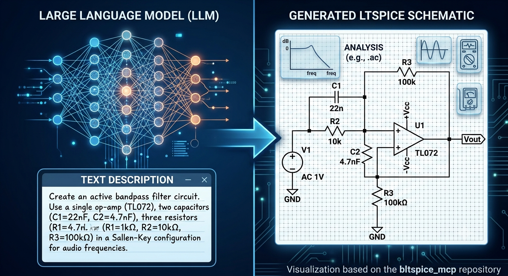
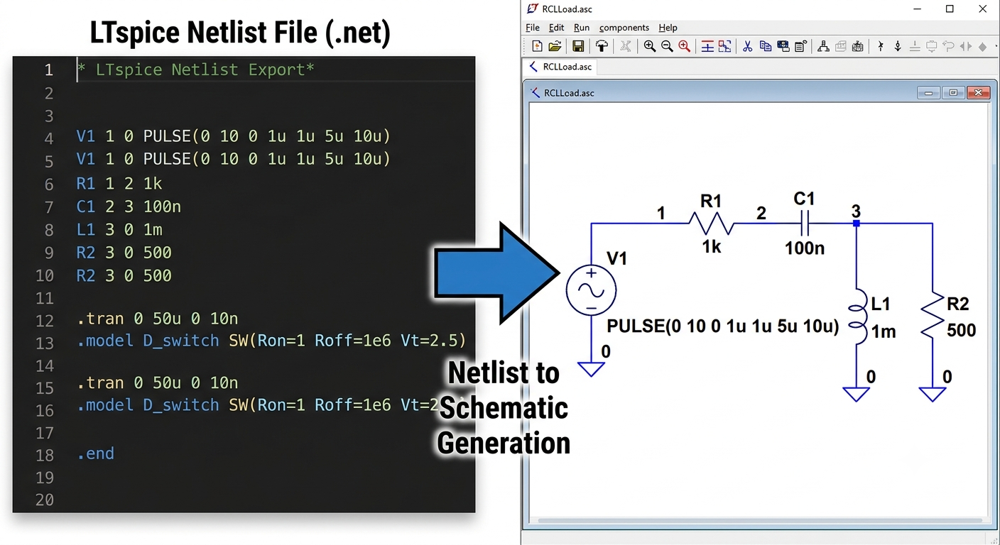
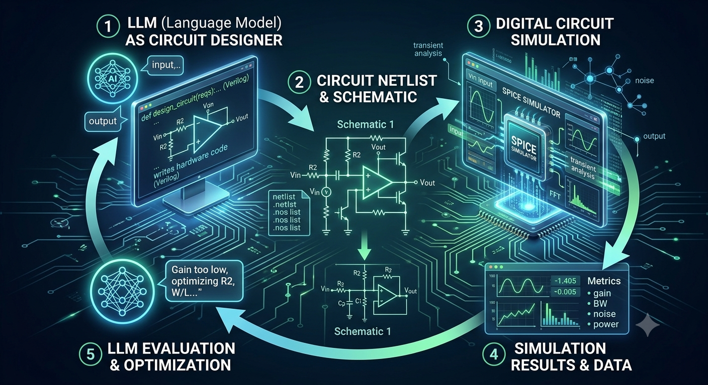

# Tutorial for Circuit Design In LTSpice using LLMs

# Install
Install these first and add to your harness
- https://github.com/BrosnanYuen/symbolic_math_mcp
- https://github.com/BrosnanYuen/bltspice_mcp

# Example Workflow Prompt for Active Bandpass Filter

You are an electrical engineering assistant specializing in circuit design and LTSpice

Goal: Design an active bandpass filter using opamps that has cutoff frequency between 30 Hz and 25 KHz
where the cutoff frequency has half the power of the peak. Use +12V and -12V rails.

There are four phases for the the design, ONLY FOLLOW IN THIS ORDER:

- Phase 1: Search the web and examples for the optimal design
- Phase 2: Calculate the values for the components and verify the calculations using symbolic_math_mcp
- Phase 3: Use the calculations to create a LTSpice netlist file .net and simulate to verify the results using ltspice_mcp
- Phase 4: Finally, convert LTSpice netlist file .net to LTSpice asc file .asc using ltspice_mcp

If something is wrong delete everything and start from begining

ONLY WRITE TO FILES INSIDE THIS FOLDER

DO NOT WRITE TO ANY FILES OUTSIDE THIS FOLDER

CAN READ FILES OUTSIDE THIS FOLDER

# Phase 1: Research circuit design
Search the web for circuit designs that can be created and simulated in LTSpice
Read some .yaml and .net files in ./examples/

# Phase 2: Calculate values for circuit design
1) Read ./YAML_tutorial.md and some of the example .yaml files in ./examples/ to create a new ./circuit.yaml containing the calculations for the circuit design

Use simple equations and calculations.

2) Read ./symbolic_math_mcp_for_LLM.md on how to use the symbolic_math_mcp server to verify the newly created ./circuit.yaml

Wait symbolic_math_mcp tool call to finish

# Phase 3: Create the LTSpice netlist file .net
1) Read ./LTSPICE_NET.md and some of the example .net files in ./examples/ to create a new LTSpice netlist ./circuit.net using the calculations above

DO NOT USE ANY COMPONENTS OUTSIDE OF THE LTSPICE library of ~/.wine/drive_c/users/brosnan/AppData/Local/LTspice/

2) Read ./bltspice_mcp_for_LLM.md and ./run_ltspice_netlist_to_csv.md to simulate the LTSpice netlist ./circuit.net and get a .csv file of simulation to verify the circuit is designed correctly. ONLY READ ./bltspice_tool_call_fails.md if have errors with tool calls in mcp server

3) Write python code to read the .csv files and verify the circuit design works.

MUST HAVE: 30 Hz and 25 KHz cutoff freq

# Phase 4: Convert the LTSpice .net to .asc
Read ./bltspice_mcp_for_LLM.md and use ltspice_netlist_to_asc from ltspice_mcp to convert LTSpice .net files to LTSpice .asc files

ONLY READ ./LTSPICE_ERROR_CODES.md if have errors with conversion

# Example Workflow Prompt for Unique Power Supply

You are an electrical engineering assistant specializing in circuit design and LTSpice

Goal:   Design the most power efficient power supply that meets this requirement
        Do not make your own rectifiers/buck/boost converter
        Use existing analog devices rectifiers/buck/boost converter blocks in LTSpice library
        Power supply input: 80V AC at 10A at 77Hz and 200mV noise
        Output power rail 1: 17.3V DC at 4A with less than 10mV peak to peak ripple noise
        Output power rail 2(negative): -3.7V DC at 3A with less than 10mV peak to peak ripple noise

There are four phases for the the design, ONLY FOLLOW IN THIS ORDER:

- Phase 1: Search the web and examples for the optimal design
- Phase 2: Calculate the values for the components and verify the calculations using symbolic_math_mcp
- Phase 3: Use the calculations to create a LTSpice netlist file .net and simulate to verify the results using ltspice_mcp
- Phase 4: Finally, convert LTSpice netlist file .net to LTSpice asc file .asc using ltspice_mcp

If something is wrong delete everything and start from begining

ONLY WRITE TO FILES INSIDE THIS FOLDER

DO NOT WRITE TO ANY FILES OUTSIDE THIS FOLDER

CAN READ FILES OUTSIDE THIS FOLDER

# Phase 1: Research circuit design
Search the web for circuit designs that can be created and simulated in LTSpice
Read some .yaml and .net files in ./examples/

# Phase 2: Calculate values for circuit design
1) Read ./YAML_tutorial.md and some of the example .yaml files in ./examples/ to create a new ./circuit.yaml containing the calculations for the circuit design

Use simple equations and calculations.

2) Read ./symbolic_math_mcp_for_LLM.md on how to use the symbolic_math_mcp server to verify the newly created ./circuit.yaml

Wait symbolic_math_mcp tool call to finish

# Phase 3: Create the LTSpice netlist file .net
1) Read ./LTSPICE_NET.md and some of the example .net files in ./examples/ to create a new LTSpice netlist ./circuit.net using the calculations above

DO NOT USE ANY COMPONENTS OUTSIDE OF THE LTSPICE library of ~/.wine/drive_c/users/brosnan/AppData/Local/LTspice/

2) Read ./bltspice_mcp_for_LLM.md and ./run_ltspice_netlist_to_csv.md to simulate the LTSpice netlist ./circuit.net and get a .csv file of simulation to verify the circuit is designed correctly. ONLY READ ./bltspice_tool_call_fails.md if have errors with tool calls in mcp server

3) Write python code to read the .csv files and verify the circuit design works.

MUST HAVE: Correct input and output power rails

# Phase 4: Convert the LTSpice .net to .asc
Read ./bltspice_mcp_for_LLM.md and use ltspice_netlist_to_asc from ltspice_mcp to convert LTSpice .net files to LTSpice .asc files

ONLY READ ./LTSPICE_ERROR_CODES.md if have errors with conversion
